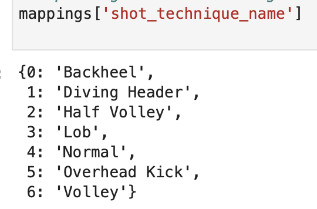

# MODELING EXPECTED GOAL PREDICTIONS

Statsbomb is a soccer analytics organization that provides data science for teams, media, and gambling. Open dataset on GitHub.

## Capstone 1:

- 2018 Men's World Cup, 64 games, 230,000 rows, 121 features.
- `shot_statsbomb_xg`  - rate of shot between `0` and `1`

## Capstone 2:

2019 Women's World Cup, NWSL 2018, FAWSL 2018/2019, FAWSL 2019/2020

282 games, 940,000+ rows, 150+ columns

## Data Cleaning/EDA

- Filtered for events that include `type_event_name` `shot`
- Removed `penalty_kick`
    - Good choice, bad choice?
- Removed `pass_goal_assist` and `pass_shot_assist`
    - Took me a while to understand that `pass_shot_assist` had to go - OOPS!
- Removed all `id` columns that had a corresponding `name` column
- Set `bool` cols to `0` for `False`, `1` for `True`
- Used `abs(pass_angle)` to avoid left/right complication
- Simplified `pass_body_part_name` to only `'foot'`, `'head'`, `'other'`  to also avoid left/left right and outliers
- Dropped all columns that had all `nan`
- Dropped 125 columns

### Result

- 7308 shots
- 33 hand-selected features
- `pass_cut_back`

    

- `pass_cross`

    

- Kept `player_name`, and no point found it was obviously hurting model, but seems plausible with 7k shots and 600 players that it could be noise

## Feature Engineering

17 features in total

### Previous Event

Used previous `event_type_name` to create `follow_x` features:

- `follows = ['follows_pass', 'follows_ball_recovery', 'follows_duel',
'follows_interception', 'follows_clearance', 'follows_goalkeeper', 'follows_miscontrol', 'follows_error', 'follows_block', 'follows_dispossessed',
'follows_dribble']`

### Multi-Event

Used `possession_team_name` and `duration` to create chains.

- `build_up_duration` cumulative length of possession in a single chain of possession that ends in shot

### Location-based Features

Used goal location `(120, 40)`, player `location` to create:

- `angle` of shooter from center of goal
    - adding position of goalkeeper would possibly be really valuable too - NEXT TIME
- `distance` of shooter from the goal
- `shot_cone` triangle area between shooter and two goalposts

Included `freeze_frame_shot` information to include opponents' `location`:

- `distance_to_nearest_opponent` how far from shooter is the nearest opponent
- `num_players_in_shot_cone` how many players are between the shooter and the goal

## Final Features List

## Label Encoding and One-Hot Encoding

- One-Hot Encoding proved to be slightly better in scoring in this instance
- Didn't One-Hot Encode `player_name` or `possession_team_name`, using Label Encoding

## Correlation

- Lost an `engineered_feat` somewhere. Honestly had a tough time keeping track of everything. Had 6 Jupyter Notebooks along the way.

- Why are `shot_type_name_3` and `shot_type_name_1` highly correlated?
- And `shot_technique_name_2` and `shot_technique_name_4`?

## Exploring Quirks of Features

- Important to check data thoroughly and remain skeptical

## Machine Learning

### Supervised vs Unsupervised

- Going Supervised approach, which is obvious with predicting goals. Would be interesting to try an Unsupervised approach at some point.

### Classification vs Regression

- Classification - Goal or No Goal
    - `predict_proba` to create Expected Goal stat

### Imbalanced Class

- Goals are inherently imbalanced
- Care more about positive class - predicting No Goals comparatively easy with ~9:1 odds

- Dealt with class imbalance with `StratifiedKFold`. Wasn't sure it was enough. Question number 2 million. Land confirmed it wasn't this morning.
- Probably upsampling approach to keep all my data.

### Parametric vs Non-Parametric

- Not sure about this topic, used `spearman` for correlation, which works better in non-parametric instances.
    - Seemed safer to me.

## Scoring

- `neg_log_loss` - With logistic regression
- `accuracy` - Not going with accuracy, because easy to get high accuracy with an imbalanced majority class.
    - False positive rate for highly imbalanced datasets is pulled down due to a large number of true negatives.
- `roc_auc_score` - Using roc-auc not great when data is heavily imbalanced
    - More useful when care equally about positive and negative classes.
- `average_precision` (PR AUC)
    - Think of it as average of precision scores calculated for each recall threshold.
    - When data is heavily imbalanced
    - When you care more about positive than negative class

## Models

### Logistic Regression

### Random Forest Classification

- Figuring out `n_estimators`

### Feature Importance Approaches:

1). `forest.feature_importances_`

Resulting `selected_feat`:

- Exciting to see that top 4 were `engineered`

- Disappointing to see that using `selected_features` did not help in scoring

All `feat_1hot`

Just `selected_features`

2). `plot_dendrogram`

`feat_le`

`feat_1hot`

`engineered`

- Without `shot_cone` (lost `shot_cone` at some point)
    - `shot_cone`, according to dendrogram providing similar information, as `distance`, which makes sense considering used `distance` to create `shot_cone`
- Exciting to see here, as in `corr`, that `engineered` not highly correlated

### Gradient Boosting

- A little bit higher scoring than `RandomForestClassifier` and `SVC`
    - `average_precision`
        - Went with `average_precision` because it supposedly handles class imbalance and prioritizing positive class well
        - `GBC` - `0.43`
        - `RFC` - `0.41`
        - `SVC` - `0.39`

## Conclusion/Concluding Questions

- What do you do when removing features doesn't seem to improve the model?
- Got to the point where I am pretty unsure what to try next without a bunch more reading or conversation, so in that sense, feels like a week where I didn't run out of stuff to try on my own, even though I didn't get to the point that I want.

## Thank You's

To you for listening!

Blogs like:

[https://machinelearningmastery.com/gradient-boosting-with-scikit-learn-xgboost-lightgbm-and-catboost/](https://machinelearningmastery.com/gradient-boosting-with-scikit-learn-xgboost-lightgbm-and-catboost/)

[https://towardsdatascience.com/feature-selection-using-random-forest-26d7b747597f](https://towardsdatascience.com/feature-selection-using-random-forest-26d7b747597f)

[https://www.kaggle.com/bbloggsbott/feature-selection-correlation-and-p-value](https://www.kaggle.com/bbloggsbott/feature-selection-correlation-and-p-value)

SKLearn in general

[https://scikit-learn.org/stable/auto_examples/model_selection/plot_precision_recall.html#sphx-glr-auto-examples-model-selection-plot-precision-recall-py](https://scikit-learn.org/stable/auto_examples/model_selection/plot_precision_recall.html#sphx-glr-auto-examples-model-selection-plot-precision-recall-py)

Our instructional staff and group mates
